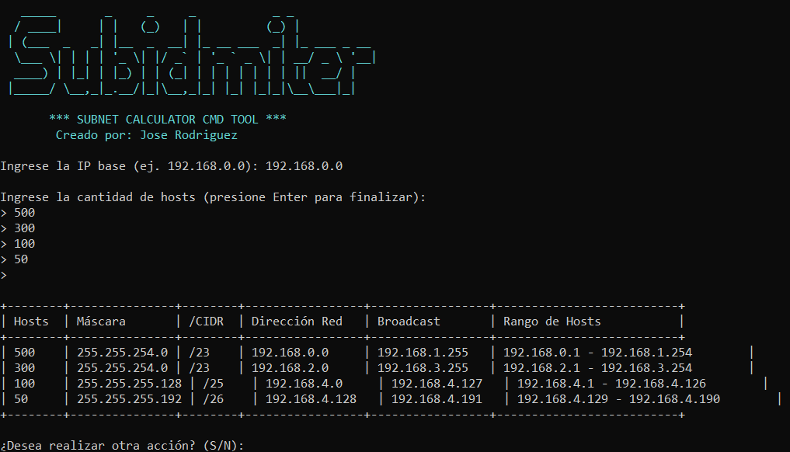

<p align="center">

</p>

# SubnetterCSharp

Una aplicación de consola desarrollada en C# para calcular y dividir subredes de manera rápida y sencilla.

## 📌 Descripción
<p align="center"></p>
**SubnetterCSharp** es una herramienta ligera para administradores de red, estudiantes o cualquier persona que necesite dividir una red en subredes más pequeñas. Esta aplicación permite introducir una dirección IP con su máscara y devuelve una lista de subredes posibles según los parámetros dados.

## ⚙️ Características

- Entrada de IP y máscara de red.
- Cálculo de subredes disponibles.
- Visualización de rangos de IPs por subred.
- Soporte para IPv4 (versión IPv6 próximamente).
- Interfaz de consola sencilla e intuitiva.

## 🖥️ Requisitos

- [.NET SDK 6.0+](https://dotnet.microsoft.com/en-us/download) instalado
- Sistema operativo compatible con .NET (Windows, Linux, macOS)

## 🚀 Ejecución

Clona el repositorio y compila el proyecto con los siguientes comandos o descarga el .exe <a href="https://drive.google.com/file/d/1xSG16nwIZw5-gY1QzCygFqfffvuiTnCx/view?usp=sharing">archivo .exe</a>:

```bash
git clone https://github.com/Rguezpjm/Subidmiter.git
cd Subidmiter
dotnet run
